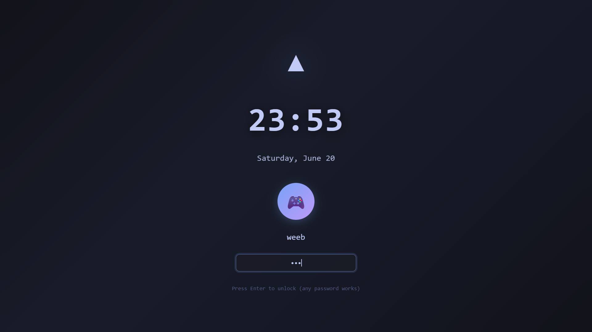
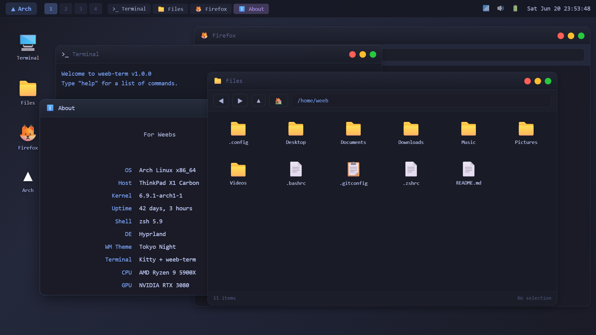

# Arch Linux for Weebs

A stylized Arch Linux desktop environment simulator built with React, featuring anime-inspired aesthetics and a fully interactive desktop experience.

<p align="center">
  
</p>

<p align="center">
  
</p>

## Features

- **Boot Sequence** - Realistic terminal-style boot animation
- **Lock Screen** - Customizable lock screen with clock display
- **Desktop Environment** - Full window management with drag, resize, minimize, maximize, and close
- **App Launcher** - Grid-based application launcher with search functionality
- **Taskbar Panel** - System tray with clock, active windows, and quick access
- **Right-Click Context Menu** - Desktop and window context menus

## Built-in Applications

| App | Description |
|-----|-------------|
| Terminal | Terminal emulator with command history |
| File Manager | Hierarchical file browser with tree view |
| Text Editor | Syntax-highlighted code editor |
| Browser | Simulated web browser with bookmarks |
| System Monitor | CPU, memory, and network visualization |
| Settings | Desktop customization and theme settings |
| About | System information display |

## Tech Stack

- React 19 + TypeScript
- Vite
- styled-components

## Getting Started

```bash
# Clone the repository
git clone https://github.com/yourusername/react-arch-linux-weeb.git

# Install dependencies
npm install

# Start development server
npm run dev

# Build for production
npm run build
```

## Development

```bash
# Run linting
npm run lint

# Preview production build
npm run preview
```

## License

MIT
